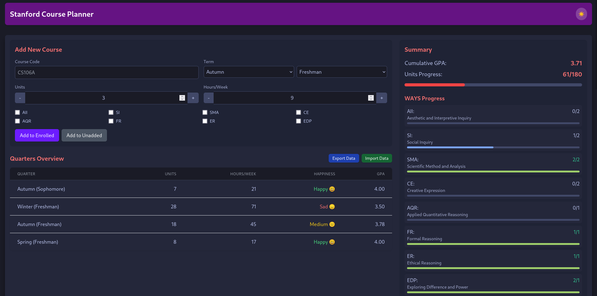
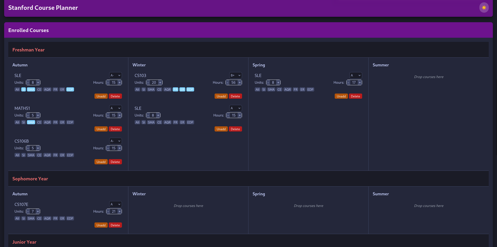

# Stanford Course Planner

A super simple web application to help Stanford students plan their academic journey, track GPA, monitor workload, and ensure WAYS requirements are met. OnCourse and Carta are much better, but this planner also calculates gpa!



## Features

- **Course Management**: Add, edit, and organize courses by year (Freshman, Sophomore, Junior, Senior) and quarter
- **Drag & Drop**: Easily move courses between quarters with intuitive drag and drop
- **GPA Calculation**: Automatically calculates GPA using Stanford's 4.2 scale
- **WAYS Requirements Tracking**: Visual progress bars for all eight WAYS categories
- **Workload Assessment**: Color-coded happiness ratings based on weekly hours
- **Graduation Progress**: Track progress toward 180 units required for graduation
- **Dark/Light Mode**: Toggle between light and dark themes
- **Data Persistence**: Automatic saving to browser's local storage
- **Import/Export**: Save and share your academic plan

## WAYS Requirements Tracked

- **AII**: Aesthetic and Interpretive Inquiry (2 courses)
- **SI**: Social Inquiry (2 courses)
- **SMA**: Scientific Method and Analysis (2 courses)
- **CE**: Creative Expression (2 units)
- **AQR**: Applied Quantitative Reasoning (1 course)
- **FR**: Formal Reasoning (1 course)
- **ER**: Ethical Reasoning (1 course)
- **EDP**: Exploring Difference and Power (1 course)

## Getting Started

### Quick Start

1. Clone this repository:
   ```
   git clone https://github.com/rivercraft911/stanfordcourseplanner.git
   ```
2. Open `index.html` in your web browser
3. Start planning your courses!

### No Installation Required

This is a pure HTML/JavaScript application that runs entirely in your browser. No server, build process, or installation required.

## Repository Structure

```
stanford-course-planner/
├── index.html          # Main HTML file - open this to run the application
├── script.js           # Application logic and React components
├── README.md           # This file
└── screenshot.png      # (Optional) Screenshot of the application
```

## How It Works

- **React**: The entire application is built using React via CDN, no build tools required
- **Tailwind CSS**: Styling is handled through Tailwind CSS via CDN
- **Lodash**: Used for data manipulation functions
- **Local Storage**: Your course data is automatically saved to your browser's local storage
- **No Backend**: Everything runs in your browser, with no server required

## Development

To modify the application:

1. Edit `script.js` to change the application logic
2. Edit `index.html` to modify the HTML structure or add additional libraries
3. Refresh your browser to see changes

## License

MIT